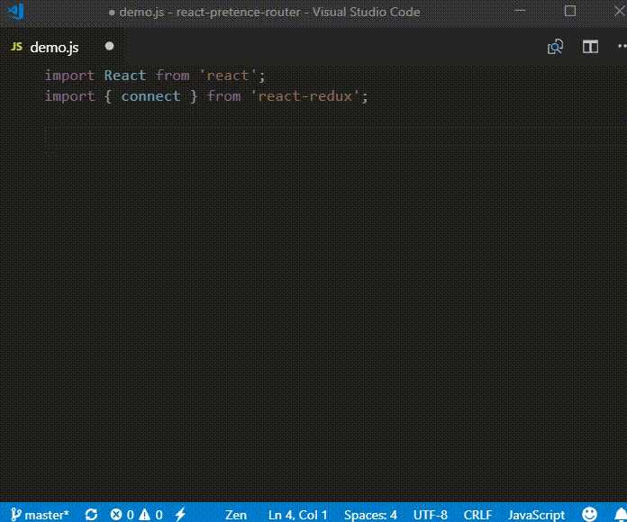

# Extra React code snippets

This is only an extra code snippets for React when you have installed other extensions like [Simple React Snippets](https://marketplace.visualstudio.com/items?itemName=burkeholland.simple-react-snippets).

## Features

Visual Studio Code IntelliSense is very powerful and you don't need remember all prefixs. You type `rr` to show all React code snippets in code completion and continue with something like: `git, im, ren, cla, con, map`.

### React
|Prefix (`rr`)|Description|
|---|---|
|**Import**||
|`rrImRender`|Import render() from ReactDOM|
|`rrImReactDOMRender`|Import ReactDOM and render()|
|**Render**||
|`rrRenderDom`|Create ReactDOM.render()|
|`rrRender`|Create only render()|
|**Class**||
|`rrClassComponent`|Create class component|
|`rrClassComponentFull`|Create full class component|
|`rrConstructor`|Create constructor()|
|`rrmethod`|Create method with ES7 syntax|
|**Map**||
|`rrmapDispatchToProps`|Create mapDispatchToProps()|
|`rrmapStateToProps`|Create mapStateToProps()|

### Other
|Prefix|Description|
|---|---|
|`gitig`|Create .gitignore file content|
|`mep`|Declare multiple module.exports|

### Support to [react-pretence-router](https://www.npmjs.com/package/react-pretence-router)
|Prefix (`rpr`)|Description|
|---|---|
|**Import**||
|`rprImportRouter`|Import `{Route}` component and router reducers|
|`rprImportLink`|Import `{Link}` component|
|**Component**||
|`rprRouteComponent`|Create `<Route/>` component|
|`rprLinkComponent`|Create `<Link/>` component|

**Enjoy coding and free your mind!** (^_^)
